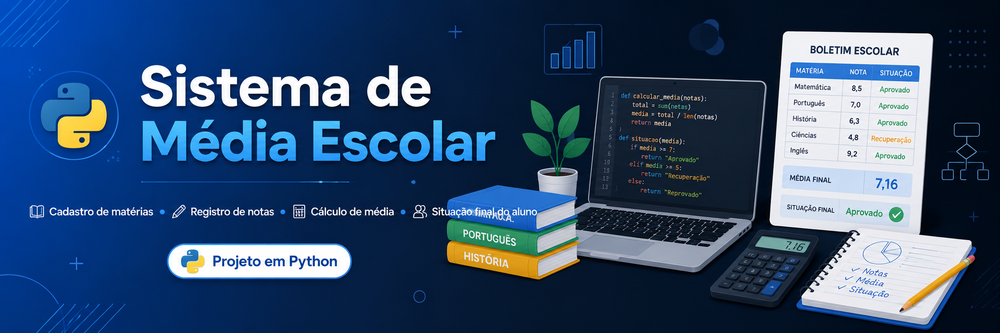

<p align="center">
  
</p>
 
<h1 align="center">📚 Sistema de Média Escolar em Python</h1>
 
<p align="center">
  
</p>
 
<p align="center">
  
  
  
</p>
 
---
 
## 📌 Sobre o projeto
 
O **Sistema de Média Escolar** é um projeto simples em Python desenvolvido para cadastrar matérias ou módulos, registrar notas, calcular a média final do aluno e informar sua situação com base nas regras definidas pelo usuário.
 
Este projeto foi criado com o objetivo de fortalecer fundamentos importantes da linguagem Python, corrigir pequenas dúvidas durante a prática e transformar conceitos básicos em um programa funcional no terminal.
 
A proposta principal foi treinar lógica de programação com foco em:
 
- entrada de dados;
- validação de informações;
- uso de listas e dicionários;
- funções;
- estruturas de repetição;
- tratamento de erros;
- organização da saída no terminal.
 
---
 
## 🎯 Objetivo
 
O projeto foi desenvolvido para praticar e consolidar fundamentos de Python de forma prática.
 
A ideia surgiu durante um treino de lógica, inicialmente com uma calculadora simples de média. Depois, o projeto evoluiu para permitir que o próprio usuário cadastrasse as matérias da grade curricular, definisse as médias de aprovação e recuperação, inserisse as notas e recebesse um boletim final no terminal.
 
---
 
## 🧠 Aprendizados trabalhados
 
Durante o desenvolvimento, foram praticados conceitos como:
 
```python
listas
dicionários
for
while
input
strip()
replace()
try / except
float()
funções
return
if / elif / else
f-strings
validação de dados
```
 
Além disso, o projeto ajudou a reforçar a importância de criar programas que não apenas funcionam, mas também tratam erros e orientam melhor o usuário.
 
---
 
## ⚙️ Funcionalidades
 
✅ Cadastro dinâmico de matérias ou módulos  
✅ Validação para impedir matérias em branco  
✅ Bloqueio de matérias duplicadas  
✅ Registro de notas entre 0 e 10  
✅ Aceita notas com ponto ou vírgula  
✅ Tratamento de erro para entradas inválidas  
✅ Definição personalizada da média de aprovação  
✅ Definição personalizada da média de recuperação  
✅ Cálculo automático da média final  
✅ Exibição do boletim no terminal  
✅ Verificação da situação final do aluno  
 
---
 
## 🖥️ Exemplo de funcionamento
 
```txt
=== SISTEMA DE MÉDIA ESCOLAR ===
 
Cadastre as matérias ou módulos da grade curricular.
Digite 'sair' quando terminar o cadastro.
 
Digite o nome da matéria/módulo: Python
Matéria adicionada: Python
 
Digite o nome da matéria/módulo: Banco de Dados
Matéria adicionada: Banco de Dados
 
Digite o nome da matéria/módulo: sair
 
=== CONFIGURAÇÃO DAS MÉDIAS ===
 
Digite a média mínima para aprovação: 7
Digite a média mínima para recuperação: 5
 
=== MATÉRIAS CADASTRADAS ===
 
1 - Python
2 - Banco de Dados
 
Digite a nota de Python: 8.5
Digite a nota de Banco de Dados: 7.0
 
=== BOLETIM DO ALUNO ===
 
Python: 8.50
Banco de Dados: 7.00
 
--------------------------------------------------
SITUAÇÃO FINAL: APROVADO
Média final: 7.75
Média necessária para aprovação: 7.00
Parabéns! O aluno atingiu a média necessária.
--------------------------------------------------
```
 
---
 
## 🧩 Estrutura do projeto
 
```txt
sistema-media-escolar-python/
│
├── assets/
│   └── banner.png
│
├── main.py
├── README.md
└── .gitignore
```
 
---
 
## 🚀 Como executar o projeto
 
### 1. Clone o repositório
 
```bash
git clone https://github.com/Dinox75/sistema-media-escolar-python.git
```
 
### 2. Acesse a pasta do projeto
 
```bash
cd sistema-media-escolar-python
```
 
### 3. Execute o arquivo principal
 
```bash
python main.py
```
 
---
 
## 🛠️ Tecnologias utilizadas
 
| Tecnologia | Uso no projeto |
|---|---|
| Python | Linguagem principal |
| Terminal | Interface de interação |
| Git | Controle de versão |
| GitHub | Hospedagem do projeto |
 
---
 
## 🔍 Validações implementadas
 
O sistema possui validações para evitar erros comuns durante a execução.
 
### Matérias
 
- Não aceita campo vazio.
- Não permite matérias repetidas.
- Permite encerrar o cadastro digitando `sair`.
 
### Notas
 
- Não aceita campo vazio.
- Aceita números com vírgula ou ponto.
- Não aceita texto no lugar de número.
- Não aceita notas menores que 0.
- Não aceita notas maiores que 10.
 
### Médias
 
- Permite definir a média mínima de aprovação.
- Permite definir a média mínima de recuperação.
- Impede que a média de recuperação seja maior ou igual à média de aprovação.
 
---
 
## 📈 Possíveis melhorias futuras
 
Algumas melhorias que podem ser adicionadas futuramente:
 
- [ ] Criar menu principal.
- [ ] Permitir editar notas cadastradas.
- [ ] Permitir remover matérias.
- [ ] Salvar boletins em arquivo `.txt`.
- [ ] Salvar dados em `.json`.
- [ ] Criar média ponderada com pesos diferentes.
- [ ] Separar o projeto em módulos.
- [ ] Criar interface gráfica simples.
- [ ] Gerar relatório final mais completo.
 
---
 
## 💡 Observação sobre o desenvolvimento
 
Este projeto foi desenvolvido com foco em aprendizado e prática.
 
A maior parte da construção foi feita de forma autônoma, buscando exercitar o raciocínio lógico e evitar dependência excessiva de ferramentas externas.
 
A Inteligência Artificial foi utilizada apenas como apoio pontual para revisão final de linguagem, correção de acentuação, organização de explicações e esclarecimento de dúvidas durante o processo.
 
O objetivo principal foi aprender fazendo.
 
---
 
## 📚 O que este projeto representa
 
Apesar de ser um projeto simples, ele representa uma etapa importante no desenvolvimento dos fundamentos de programação.
 
Aqui foram aplicados conceitos essenciais que aparecem em projetos maiores, como:
 
- coleta de dados;
- tratamento de entrada;
- organização de informações;
- tomada de decisão;
- reaproveitamento de código com funções;
- validação antes de processar dados.
 
Projetos pequenos também constroem base.  
E base forte sustenta projetos maiores.
 
---
 
## 👨‍💻 Autor
 
Desenvolvido por **Vinicius Lima**.
 
<p align="left">
  <a href="https://github.com/Dinox75">
    
  </a>
</p>
 
---
 
<p align="center">
  
</p>
